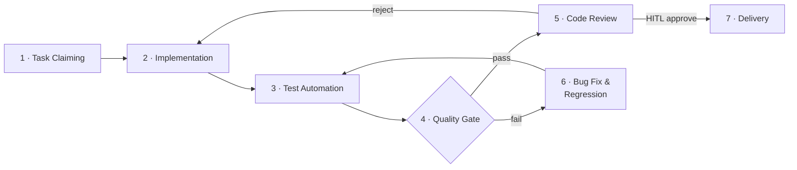

# Harness Engineering — 流程总索引

> Claude Code 入队后的第二个读物（在 `CLAUDE.md` 之后）。
> 定义完整开发循环的各阶段、负责方、治理规程与当前状态。
> 标注 🔲 stub 的阶段已在流程中显性化，但规程尚未完善，可迭代补充。

---

## 开发循环



> Stage 2（Acceptance Test Design）已内嵌为"实现前读 TC"步骤，不单独成阶段。
> `tc_policy` 控制是否强制要求 TC 先行（见 requirement-standard.md §6）。

---

## 阶段总览

| # | 阶段 | 中文名 | 主责 | 治理规程 | 状态 |
|---|---|---|---|---|---|
| 1 | Task Claiming | 任务认领 | claude_code | [requirement-standard](requirement-standard.md) §6–7 | ✅ active |
| 2 | Implementation | 功能实现 | **claude_code** | [requirement-standard](requirement-standard.md) §9.1 | ✅ active |
| 3 | Test Automation | 测试自动化 | claude_code | [testing-standard](testing-standard.md) §2 | ✅ active |
| 4 | Quality Gate | 质量门禁 | CI (automated) | [ci-standard](ci-standard.md) | ✅ active |
| 5 | Code Review | 代码审查 | **Huahua**（review owner） | [review-standard](review-standard.md) | ✅ active |
| 6 | Bug Fix & Regression | 缺陷修复与回归 | **claude_code** | [bug-standard](bug-standard.md) §5–6 | ✅ active |
| 7 | Delivery | 合并交付 | HITL (PR merge) | [requirement-standard](requirement-standard.md) §9.3 | ✅ active |

> **Review owner**：阶段 5 由 Huahua 主责 code review，findings 回传 claude_code 修复。
> **HITL checkpoint**：阶段 7 的 PR merge 必须 Daniel 人工拍板，不允许自动合入。

---

## 规程文档索引

> 状态说明：✅ active = 可执行、经过 review；🔲 stub = 已占位，规则尚未完整，按现有内容尽力执行。

| 规程 | 文件 | 状态 |
|---|---|---|
| 需求管理 | [requirement-standard.md](requirement-standard.md) | ✅ active |
| 测试规范 | [testing-standard.md](testing-standard.md) | ✅ active |
| Bug 管理 | [bug-standard.md](bug-standard.md) | ✅ active |
| 代码审查 | [review-standard.md](review-standard.md) | ✅ active — Pandas 触发→Huahua（CodeX）review→Telegram HITL 合并 |
| CI / 质量门禁 | [ci-standard.md](ci-standard.md) | ✅ active |
| Agent CLI 调用模板 | [agent-cli-playbook.md](agent-cli-playbook.md) | ✅ active — 模板 A–L，覆盖实现、Bug 修复、Fix Review、一致性审查、Pandas 编排（K）、Memory Curation（L） |
| Inbox IPC 协议 | [inbox-protocol.md](inbox-protocol.md) | ✅ active — ATM Envelope 规范（REQ-033–036 全部完成）；lifecycle 目录 pending/claimed/done/failed；Thread/Correlation 追踪；Delegation 结构化；规范文件命名 |

---

## Agent 分工

| 角色 | 主导阶段 | 说明 |
|---|---|---|
| **pandas**（orchestrator） | 全流程协调 | 轮询任务队列、触发 Menglan 实现、通知 Huahua review、发 Telegram HITL 告警；**不读 PR diff，不发 review comments** |
| **menglan**（claude_code） | 1–3, 6 | 认领任务、实现代码、测试自动化、Bug 修复、修复 review findings |
| **huahua** | 5 | Code review（review owner）；使用 CodeX + GH LLM Issue Orchestrator；findings 以 PR review comments 形式输出 |
| **human (Daniel)** | 7 | PR merge judgment（HITL gate）—— 通过 Telegram [Merge] 按钮或手动合并；不做 code review |

---

## 事实源边界

| 对象 | 默认事实源 | 说明 |
|---|---|---|
| REQ / Phase / TC | repo `tasks/` | Agent 开发输入，需本地可读、可扫描、可回写 |
| PR / Review / Merge | GitHub PR | reviewer、review comments、reviewDecision、merge gate 不在 repo 内重复建模 |
| Bug | GitHub（默认） | 日常缺陷、PR review 缺陷、CI 失败优先走 GitHub |
| 长期 Bug | `tasks/bugs/`（可选） | 仅当 Bug 需要长期跟踪或被 Agent 自动挑选修复时提升为 repo 工作项 |

---

## 任务目录

```
tasks/
  phases/       PHASE-xxx  迭代边界定义
  features/     REQ-xxx    功能需求项
  bugs/         BUG-xxx    可选：长期跟踪的 repo 内 Bug
  test-cases/   TC-xxx     验收测试用例（先于实现创建）
  archive/
    done/                  已完成
    cancelled/             已废弃
```

---

## 自动化流程（Semi-Autonomous Loop）

当前采用半自治循环：Pandas 编排，Daniel 通过 Telegram 做最终决策。

```
PR merged to main
    └─▶ GitHub Action: ci.yml (req-coverage job)
            └─▶ 扫描 tasks/features/：frontmatter 校验 + orphan/ghost 检测

Pandas orchestration loop（模板 K）：
    └─▶ 检查 for-pandas/ inbox 新结果包（inbox_read_pandas()，原子 mv pending→claimed）
            └─▶ harness.sh status → 有可认领任务
                    └─▶ harness.sh implement <REQ-N>（触发 Menglan）
                            └─▶ worktree 创建：~/workspace-menglan/open-workhorse/ → feat/REQ-N
                                    └─▶ Menglan 开 PR
                                            └─▶ Pandas 写 review packet → for-huahua/ inbox
                                                    └─▶ Huahua（CodeX）输出 review comments
                                                            └─▶ Pandas 触发 fix-review（如有 blocking findings）
                                                                    └─▶ Pandas 发 Telegram tg_pr_ready → Daniel [Merge] / [Hold]
                                                                            └─▶ Daniel merge PR
                                                                                    └─▶ Pandas: harness.sh worktree-clean <REQ-N>（清理 worktree）
                                                                                            └─▶ Pandas 心跳 S2：扫到 status:done → 发 Telegram 归档通知
                                                                                                    └─▶ Daniel 确认 → Pandas 执行归档（mv REQ + TC → tasks/archive/done/）

dev-cycle-watchdog（每 5h cron）：
    └─▶ 检测 in_progress 任务停滞 / PR 无 review → Telegram 告警 Daniel
```

> Agents 每 5 分钟轮询各自 inbox。Pandas 写任务包至 `$SHARED_RESOURCES_ROOT/inbox/for-{agent}/`，读结果包自 `inbox/for-pandas/`。

> TC 设计（`tc_policy=required`）由 Menglan 在实现前完成，或在 ready 阶段由 Daniel 人工设计。

---

## Tool Registration

所有工具调用必须在以下文件中注册后方可在 harness 脚本或 agent prompt 中使用：

| 文件 | 内容 |
|---|---|
| `harness/CAPABILITIES.md` | 语义契约（Pandas 可做什么） |
| `harness/CONNECTORS.md` | 运行时绑定（在 open-workhorse 中如何调用） |

命名规范：`namespace-category-tool_name`（如 `notify-human-send_status_update`）

新增工具前，必须先在两个文件中完成注册。

---

## Memory Integration

任务完成后，specialist 将记忆候选写入：

```
~/workspace-pandas/memory/short-term/candidates/
```

Pandas 在 session 结束或批量任务完成后将候选提升至 `project.db`（SQLite）。

| 文件 | 说明 |
|---|---|
| `harness/memory-architecture.md` | 完整架构、写权限表、schema |
| `workspace-pandas/memory/long-term/schema.sql` | 表定义（来源：everything_openclaw） |

初始化：`npm run memory:init`

---

## 变更日志

| 版本 | 日期 | 变更摘要 |
|---|---|---|
| 0.1 | 2026-03-15 | 初始版本（从 hydro-om-copilot 改写）；适配单 Agent 模式（删去 openai_codex）；TC 设计内嵌为实现前步骤；删去 kb-ingestion-standard |
| 0.2 | 2026-03-15 | 引入 Pandas orchestrator 角色（不读 PR diff）；将 claude_code 明确为 Menglan；Huahua review 方式改为 CodeX + GH LLM Issue Orchestrator；自动化流程更新为 semi-autonomous loop（Telegram HITL + watchdog cron）；review-standard 更新为 active |
| 0.3 | 2026-03-18 | 引入 Tool Registration（CAPABILITIES.md / CONNECTORS.md）+ Memory Integration 节；inbox-based dispatch 说明；对齐 everything_openclaw agent_persona_harness_v0 ground truth |
| 0.4 | 2026-03-21 | inbox-protocol 行更新：status partial → active，ATM REQ-033–036 全部落地；frontmatter 版本同步；playbook 模板集更新为 A–L（含 K Pandas 编排、L Memory Curation）；自动化流程函数名更新为 inbox_read_pandas() |
| 0.5 | 2026-03-21 | REQ-037 git worktree 隔离落地：harness.sh implement 自动创建 ~/workspace-menglan/open-workhorse/ worktree；新增 worktree-clean 命令；自动化流程图补充 worktree 生命周期；playbook 模板 B/K 更新 worktree 路径说明 |
