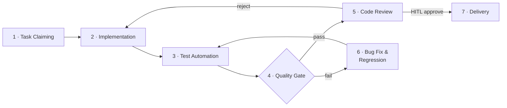

# Harness Engineering — 流程总索引

> Claude Code 入队后的第二个读物（在 `CLAUDE.md` 之后）。
> 定义完整开发循环的各阶段、负责方、治理规程与当前状态。
> 标注 🔲 stub 的阶段已在流程中显性化，但规程尚未完善，可迭代补充。

---

## 开发循环



> Stage 2（Acceptance Test Design）已内嵌为"实现前读 TC"步骤，不单独成阶段。
> `tc_policy` 控制是否强制要求 TC 先行（见 requirement-standard.md §6）。

---

## 阶段总览

| # | 阶段 | 中文名 | 主责 | 治理规程 | 状态 |
|---|---|---|---|---|---|
| 1 | Task Claiming | 任务认领 | claude_code | [requirement-standard](requirement-standard.md) §6–7 | ✅ active |
| 2 | Implementation | 功能实现 | **claude_code** | [requirement-standard](requirement-standard.md) §9.1 | ✅ active |
| 3 | Test Automation | 测试自动化 | claude_code | [testing-standard](testing-standard.md) §2 | ✅ active |
| 4 | Quality Gate | 质量门禁 | CI (automated) | [ci-standard](ci-standard.md) | ✅ active |
| 5 | Code Review | 代码审查 | **Huahua**（review owner） | [review-standard](review-standard.md) | ✅ active |
| 6 | Bug Fix & Regression | 缺陷修复与回归 | **claude_code** | [bug-standard](bug-standard.md) §5–6 | ✅ active |
| 7 | Delivery | 合并交付 | HITL (PR merge) | [requirement-standard](requirement-standard.md) §9.3 | ✅ active |

> **Review owner**：阶段 5 由 Huahua 主责 code review，findings 回传 claude_code 修复。
> **HITL checkpoint**：阶段 7 的 PR merge 必须 Daniel 人工拍板，不允许自动合入。

---

## 规程文档索引

> 状态说明：✅ active = 可执行、经过 review；🔲 stub = 已占位，规则尚未完整，按现有内容尽力执行。

| 规程 | 文件 | 状态 |
|---|---|---|
| 需求管理 | [requirement-standard.md](requirement-standard.md) | ✅ active |
| 测试规范 | [testing-standard.md](testing-standard.md) | ✅ active |
| Bug 管理 | [bug-standard.md](bug-standard.md) | ✅ active |
| 代码审查 | [review-standard.md](review-standard.md) | ✅ active — Menglan 实现完成后直接派发 code_review 给 Huahua；Huahua APPROVED 后写 review_complete 给 Pandas → Telegram HITL 合并 |
| CI / 质量门禁 | [ci-standard.md](ci-standard.md) | ✅ active |
| Agent CLI 调用模板 | [agent-cli-playbook.md](agent-cli-playbook.md) | ✅ active — 模板 A–L，覆盖实现、Bug 修复、Fix Review、一致性审查、Pandas 编排（K）、Memory Curation（L） |
| Inbox IPC 协议 | [inbox-protocol.md](inbox-protocol.md) | ✅ active — ATM Envelope 规范（REQ-033–036 全部完成）；lifecycle 目录 pending/claimed/done/failed；Thread/Correlation 追踪；Delegation 结构化；规范文件命名 |

---

## Agent 分工

| 角色 | 主导阶段 | 说明 |
|---|---|---|
| **pandas**（orchestrator） | 全流程协调 | 轮询任务队列、触发 Menglan 实现、收 Huahua review_complete 后发 Telegram HITL 告警；**不参与 code review 循环，不读 PR diff，不发 review comments** |
| **menglan**（claude_code） | 1–3, 6 | 认领任务、实现代码、测试自动化、Bug 修复、修复 review findings |
| **huahua** | 5 | Code review（review owner）；使用 CodeX + GH LLM Issue Orchestrator；findings 以 PR review comments 形式输出 |
| **human (Daniel)** | 7 | PR merge judgment（HITL gate）—— 通过 Telegram [Merge] 按钮或手动合并；不做 code review |

---

## 事实源边界

| 对象 | 默认事实源 | 说明 |
|---|---|---|
| REQ / Phase / TC | repo `tasks/` | Agent 开发输入，需本地可读、可扫描、可回写 |
| PR / Review / Merge | GitHub PR | reviewer、review comments、reviewDecision、merge gate 不在 repo 内重复建模 |
| Bug | GitHub（默认） | 日常缺陷、PR review 缺陷、CI 失败优先走 GitHub |
| 长期 Bug | `tasks/bugs/`（可选） | 仅当 Bug 需要长期跟踪或被 Agent 自动挑选修复时提升为 repo 工作项 |

---

## 任务目录

```
tasks/
  phases/       PHASE-xxx  迭代边界定义
  features/     REQ-xxx    功能需求项
  bugs/         BUG-xxx    可选：长期跟踪的 repo 内 Bug
  test-cases/   TC-xxx     验收测试用例（先于实现创建）
  archive/
    done/                  已完成
    cancelled/             已废弃
```

---

## 自动化流程（Semi-Autonomous Loop）

当前采用半自治循环：Pandas 编排，Daniel 通过 Telegram 做最终决策。

```
PR merged to main
    └─▶ GitHub Action: ci.yml (req-coverage job)
            └─▶ 扫描 tasks/features/：frontmatter 校验 + orphan/ghost 检测

Pandas orchestration loop（模板 K）：
    └─▶ 检查 for-pandas/ inbox 新结果包（inbox_read_pandas()，原子 mv pending→claimed）
            │
            │  ── 【单PR规则 REQ-039 — TC 先于 implement】────────────────────────────────
            │
            ├─▶ Huahua TC 设计阶段（tc_policy=required）：
            │       └─▶ REQ 达到 review_ready → Pandas claim_review_ready()
            │               └─▶ Pandas → for-huahua/ inbox: req_review REQ-N
            │                       └─▶ Huahua req_review handler：需求审核 + TC 设计 + 在 feat/REQ-N 开 PR
            │                               └─▶ tc_review 消息携带 branch_name=feat/REQ-N
            │                                       └─▶ 字段沿链传递：tc_review → tc_complete → implement
            │                                               └─▶ REQ 状态推进至 test_designed
            │                                   （tc_complete blocked 且 iter<2 时：Pandas → for-huahua/ inbox: tc_design REQ-N 修复迭代）
            │
            └─▶ harness.sh status → 扫到 status=test_designed（或 ready+exempt/optional）任务
                    └─▶ harness.sh implement <REQ-N>（Menglan 心跳以 EXISTING_BRANCH=feat/REQ-N 调用）
                            └─▶ worktree 创建：fetch 已有远端 feat/REQ-N 分支（非新建）
                                    └─▶ Menglan 在已有分支上实现，gh pr edit 更新同一 PR（不新建 PR）
                                            └─▶ Menglan 完成实现后直接写 code_review → for-huahua/pending/（直接循环，Pandas 不介入）
                                                    └─▶ Huahua code_review handler：输出 review comments
                                                            ├─▶ APPROVED → review_complete → for-pandas/pending/
                                                            │       └─▶ Pandas 发 tg_pr_ready → Daniel [Merge] / [Hold]
                                                            ├─▶ NEEDS_CHANGES (iter<2) → fix_review → for-menglan/pending/
                                                            │       └─▶ Menglan fix_review → harness.sh fix-review → 重新 code_review（iter+1）
                                                            └─▶ NEEDS_CHANGES (iter≥2) → tg_decision → Daniel 决策
                                                                            └─▶ Daniel merge PR（单次）
                                                                                    └─▶ Pandas 心跳 S2：扫到 status:done → 发 Telegram 归档通知
                                                                                            └─▶ _auto_worktree_clean（心跳内联，status=done 时自动移除 worktree）
                                                                                                    └─▶ Daniel 确认 → Pandas 执行归档（mv REQ + TC → tasks/archive/done/）

dev-cycle-watchdog（每 5h cron）：
    └─▶ 检测 in_progress 任务停滞 / PR 无 review → Telegram 告警 Daniel

keep-alive watchdog（Pandas 心跳内联，每 5 分钟）：
    └─▶ _check_stall_and_keepalive()：扫描 status=in_progress 的 REQ
            └─▶ 读取 runtime/{agent}_alive.ts 存活时间戳
                    └─▶ 若时间戳距今 > AGENT_STALL_TIMEOUT_MINUTES（默认 60min）：
                            └─▶ 向该 agent inbox 写 keep-alive implement 消息（含 branch_name）→ 触发恢复
```

> Agents 每 5 分钟轮询各自 inbox。Pandas 写任务包至 `$SHARED_RESOURCES_ROOT/inbox/for-{agent}/`，读结果包自 `inbox/for-pandas/`。

> TC 设计（`tc_policy=required`）：标准路径由 Huahua 在 `req_review` handler 中完成（Pandas 写 `req_review` 消息触发）；`ready` 阶段亦可由 Daniel 人工设计。

---

## Tool Registration

所有工具调用必须在以下文件中注册后方可在 harness 脚本或 agent prompt 中使用：

| 文件 | 内容 |
|---|---|
| `harness/CAPABILITIES.md` | 语义契约（Pandas 可做什么） |
| `harness/CONNECTORS.md` | 运行时绑定（在 open-workhorse 中如何调用） |

命名规范：`namespace-category-tool_name`（如 `notify-human-send_status_update`）

新增工具前，必须先在两个文件中完成注册。

---

## Memory Integration

任务完成后，specialist 将记忆候选写入：

```
~/workspace-pandas/memory/short-term/candidates/
```

Pandas 在 session 结束或批量任务完成后将候选提升至 `project.db`（SQLite）。

| 文件 | 说明 |
|---|---|
| `harness/memory-architecture.md` | 完整架构、写权限表、schema |
| `workspace-pandas/memory/long-term/schema.sql` | 表定义（来源：everything_openclaw） |

初始化：`npm run memory:init`

---

## 变更日志

| 版本 | 日期 | 变更摘要 |
|---|---|---|
| 0.1 | 2026-03-15 | 初始版本（从 hydro-om-copilot 改写）；适配单 Agent 模式（删去 openai_codex）；TC 设计内嵌为实现前步骤；删去 kb-ingestion-standard |
| 0.2 | 2026-03-15 | 引入 Pandas orchestrator 角色（不读 PR diff）；将 claude_code 明确为 Menglan；Huahua review 方式改为 CodeX + GH LLM Issue Orchestrator；自动化流程更新为 semi-autonomous loop（Telegram HITL + watchdog cron）；review-standard 更新为 active |
| 0.3 | 2026-03-18 | 引入 Tool Registration（CAPABILITIES.md / CONNECTORS.md）+ Memory Integration 节；inbox-based dispatch 说明；对齐 everything_openclaw agent_persona_harness_v0 ground truth |
| 0.4 | 2026-03-21 | inbox-protocol 行更新：status partial → active，ATM REQ-033–036 全部落地；frontmatter 版本同步；playbook 模板集更新为 A–L（含 K Pandas 编排、L Memory Curation）；自动化流程函数名更新为 inbox_read_pandas() |
| 0.5 | 2026-03-21 | REQ-037 git worktree 隔离落地：harness.sh implement 自动创建 ~/workspace-menglan/open-workhorse/ worktree；新增 worktree-clean 命令；自动化流程图补充 worktree 生命周期；playbook 模板 B/K 更新 worktree 路径说明 |
| 0.6 | 2026-03-23 | REQ-039 单PR规则 + Keep-Alive Watchdog：自动化流程图更新为单PR链路（Huahua 在 feat/REQ-N 分支建TC+开PR，branch_name 沿消息链传递至 Menglan 的 EXISTING_BRANCH）；新增 keep-alive watchdog 说明（_check_stall_and_keepalive，AGENT_STALL_TIMEOUT_MINUTES，runtime/{agent}_alive.ts 时间戳） |
| 0.7 | 2026-03-24 | 修正 TC 设计入口消息类型：由错误的 tc_design 改为正确的 req_review（Pandas claim_review_ready() 写入）；Huahua req_review handler 同时负责需求审核 + TC 设计 + 开 PR；tc_design 消息降级为 tc_complete blocked 时的修复迭代路径；修正说明注释（TC 设计由 Huahua 完成，非 Menglan） |
| 0.8 | 2026-03-26 | 修正 implement→code_review 直接循环设计漂移：Menglan 实现完成后直接写 code_review 给 Huahua（不经 Pandas）；Huahua NEEDS_CHANGES 时直接写 fix_review 给 Menglan（iter<2）或 tg_decision（iter≥2）；Pandas 仅在 APPROVED 后接收 review_complete → tg_pr_ready；角色表和流程图同步修正 |
