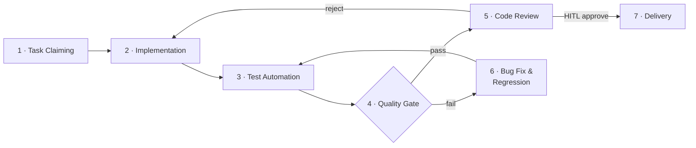

# Harness Engineering — 流程总索引

> Claude Code 入队后的第二个读物（在 `CLAUDE.md` 之后）。
> 定义完整开发循环的各阶段、负责方、治理规程与当前状态。
> 标注 🔲 stub 的阶段已在流程中显性化，但规程尚未完善，可迭代补充。

---

## 开发循环



> Stage 2（Acceptance Test Design）已内嵌为"实现前读 TC"步骤，不单独成阶段。
> `tc_policy` 控制是否强制要求 TC 先行（见 requirement-standard.md §6）。

---

## 阶段总览

| # | 阶段 | 中文名 | 主责 | 治理规程 | 状态 |
|---|---|---|---|---|---|
| 1 | Task Claiming | 任务认领 | claude_code | [requirement-standard](requirement-standard.md) §6–7 | ✅ active |
| 2 | Implementation | 功能实现 | **claude_code** | [requirement-standard](requirement-standard.md) §9.1 | ✅ active |
| 3 | Test Automation | 测试自动化 | claude_code | [testing-standard](testing-standard.md) §2 | ✅ active |
| 4 | Quality Gate | 质量门禁 | CI (automated) | [ci-standard](ci-standard.md) | ✅ active |
| 5 | Code Review | 代码审查 | **Huahua**（review owner） | [review-standard](review-standard.md) | 🔲 stub |
| 6 | Bug Fix & Regression | 缺陷修复与回归 | **claude_code** | [bug-standard](bug-standard.md) §5–6 | ✅ active |
| 7 | Delivery | 合并交付 | HITL (PR merge) | [requirement-standard](requirement-standard.md) §9.3 | ✅ active |

> **Review owner**：阶段 5 由 Huahua 主责 code review，findings 回传 claude_code 修复。
> **HITL checkpoint**：阶段 7 的 PR merge 必须 Daniel 人工拍板，不允许自动合入。

---

## 规程文档索引

> 状态说明：✅ active = 可执行、经过 review；🔲 stub = 已占位，规则尚未完整，按现有内容尽力执行。

| 规程 | 文件 | 状态 |
|---|---|---|
| 需求管理 | [requirement-standard.md](requirement-standard.md) | ✅ active |
| 测试规范 | [testing-standard.md](testing-standard.md) | ✅ active |
| Bug 管理 | [bug-standard.md](bug-standard.md) | ✅ active |
| 代码审查 | [review-standard.md](review-standard.md) | 🔲 stub — 已知原则可参考，完整规则待补 |
| CI / 质量门禁 | [ci-standard.md](ci-standard.md) | ✅ active |
| Agent CLI 调用模板 | [agent-cli-playbook.md](agent-cli-playbook.md) | ✅ active — 模板 A–J，覆盖实现、Bug 修复、Fix Review、一致性审查 |

---

## Agent 分工

| 角色 | 主导阶段 | 说明 |
|---|---|---|
| claude_code | 1–3, 6 | 认领任务、实现代码、测试自动化、Bug 修复 |
| huahua | 5 | Code review（review owner）；findings 回传 pandas / claude_code |
| human (Daniel) | 7 | PR merge judgment（HITL gate）—— 不做 code review，只做合并决策 |

---

## 事实源边界

| 对象 | 默认事实源 | 说明 |
|---|---|---|
| REQ / Phase / TC | repo `tasks/` | Agent 开发输入，需本地可读、可扫描、可回写 |
| PR / Review / Merge | GitHub PR | reviewer、review comments、reviewDecision、merge gate 不在 repo 内重复建模 |
| Bug | GitHub（默认） | 日常缺陷、PR review 缺陷、CI 失败优先走 GitHub |
| 长期 Bug | `tasks/bugs/`（可选） | 仅当 Bug 需要长期跟踪或被 Agent 自动挑选修复时提升为 repo 工作项 |

---

## 任务目录

```
tasks/
  phases/       PHASE-xxx  迭代边界定义
  features/     REQ-xxx    功能需求项
  bugs/         BUG-xxx    可选：长期跟踪的 repo 内 Bug
  test-cases/   TC-xxx     验收测试用例（先于实现创建）
  archive/
    done/                  已完成
    cancelled/             已废弃
```

---

## 自动化流程（Git-Native Orchestration）

当前阶段采用 Git-Native 方式驱动循环，不依赖常驻服务：

```
PR merged to main
    └─▶ GitHub Action: ci.yml (req-coverage job)
            └─▶ 扫描 tasks/features/：frontmatter 校验 + orphan/ghost 检测
                └─▶ 人工查看 ./scripts/harness.sh status 决定下一步
                └─▶ 手动触发 claude_code 认领实现（harness.sh implement）
```

> 单 Agent 模式：无 Pass 1/Pass 2 的 TC 设计自动分派。
> TC 设计（`tc_policy=required`）由 claude_code 在实现前完成，或在 ready 阶段由 Daniel 人工设计。

---

## 变更日志

| 版本 | 日期 | 变更摘要 |
|---|---|---|
| 0.1 | 2026-03-15 | 初始版本（从 hydro-om-copilot 改写）；适配单 Agent 模式（删去 openai_codex）；TC 设计内嵌为实现前步骤；删去 kb-ingestion-standard |
